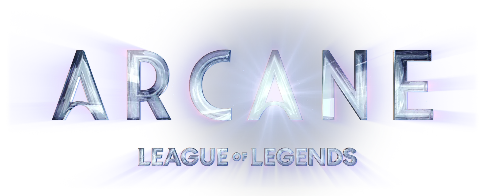
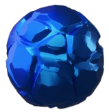
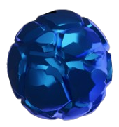
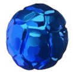

  
  
  
  
  

ArcaNetflix es un proyecto web dedicado a la serie animada Arcane, basada en el universo de League of Legends.

## ✨ Características

  
  Diseño responsivo con layouts para móvil y escritorio

  
  Showcase interactivo de personajes

  
  Carrusel de vídeos de clips de Arcane de YouTube integrados

  
  Galería de imágenes con funcionalidad de lightbox

  
  Sección de merch y colaboraciones

  
  Integración del reproductor de música de Spotify (embed sin utilizar API)

  
  Navegación con desplazamiento suave

  
  Modal de advertencia de spoilers

## 🚀 Tecnologías utilizadas

  
  <a href="https://reactjs.org/">React</a> - Biblioteca JavaScript

  
  <a href="https://nextjs.org/">Next.js</a> - Framework de React para aplicaciones web

  
  <a href="https://www.typescriptlang.org/">TypeScript</a> - Tipado de JavaScript

  
  <a href="https://tailwindcss.com/">Tailwind CSS</a> - Framework de CSS utilitario

  
  <a href="https://www.framer.com/motion/">Framer Motion</a> - Biblioteca para animaciones en React

  
  <a href="https://lucide.dev/">Lucide React</a> - Colección de iconos personalizables

  
  <a href="https://ui.shadcn.com/">ShadCN/UI</a> - Componentes UI reutilizables que mejoran la consistencia y diseño del proyecto

> Este proyecto está desplegado en [Vercel](https://vercel.com), aprovechando la velocidad y rendimiento de Next.js.

## 🌱 Ideas futuras

- Sección de fanarts
- Foro o comunidad
- Publicidad de League of Legends
- Minijuegos
- Optimización general (vídeos e imágenes)

## 📝 Licencia

Este proyecto es de código abierto y está disponible bajo la [Licencia MIT](LICENSE).

> [!NOTE]
> He creado este proyecto como fan. Arcanetflix no está afiliado ni respaldado por [Riot Games](https://www.riotgames.com) o [Netflix](https://www.netflix.com). Todo el contenido relacionado con Arcane pertenece a sus respectivos propietarios.
La página web está basada en la pñagina oficial de [Arcane](https://arcane.com)
